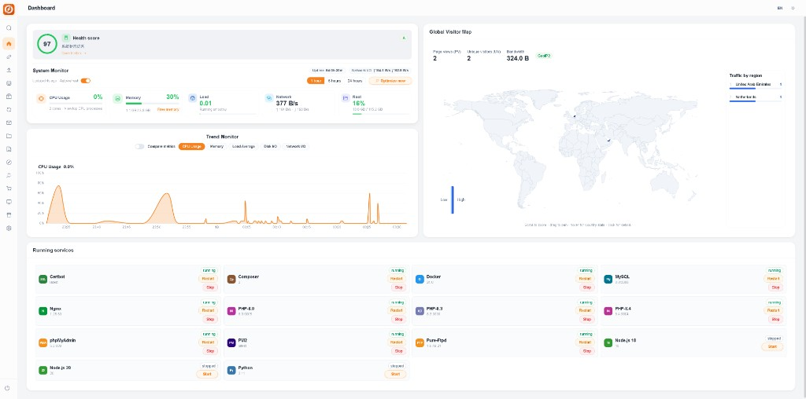
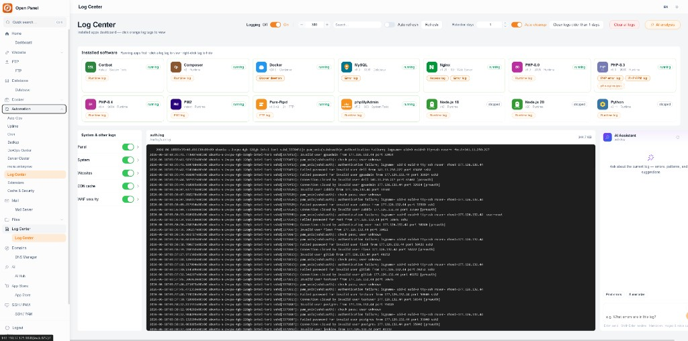

<h1 align="center">Open Panel</h1>

<p align="center">
  Self-hosted · Decentralized · Automated Linux server management
</p>

---

Open Panel is a **self-hosted**, **decentralized** control plane for your own Linux servers. No vendor lock-in, no central cloud — you run the panel on your machine, your data stays on your machine. Built-in **automation** handles backups, cron jobs, service restarts, log analysis, and AI-assisted ops so you spend less time on repetitive tasks.

### Highlights

- **Decentralized by design** — Single binary on your server; no external account or control plane required
- **Automated operations** — Scheduled backups, cron templates, one-click service control, auto log cleanup
- **Smart dashboard** — Live metrics, health score, traffic map, and running-service overview
- **AI-assisted ops** — Built-in AI for log analysis, SSH terminal help, and site/project workflows
- **Full stack control** — Websites, databases, Docker, firewall/WAF, FTP, mail, DNS from one UI

Built with **Go** + **Vue 3**. Embedded web UI, systemd service, Linux only.

### Dashboard

Real-time health, resource trends, global traffic, and one place to start/stop/restart every installed service.

<p align="center">
  
</p>

### Log Center & AI

Centralized logs across panel, system, websites, CDN, and WAF — with **AI analysis** to spot errors and suggest fixes. Auto-refresh, retention policies, and automated cleanup.

<p align="center">
  
</p>

### Install

Ubuntu, Debian, CentOS, Rocky, or AlmaLinux:

```bash
curl -fsSL https://raw.githubusercontent.com/luuuunet/open-panel/main/scripts/install.sh | sudo bash
```

Or from source:

```bash
git clone https://github.com/luuuunet/open-panel.git
cd open-panel
sudo bash scripts/install.sh
```

Open `http://YOUR_SERVER_IP:8888` — user `admin`, password in `data/INITIAL_CREDENTIALS.txt`.

### Documentation

[docs/en/USER_GUIDE.md](docs/en/USER_GUIDE.md)

### License

[MIT License](LICENSE)
